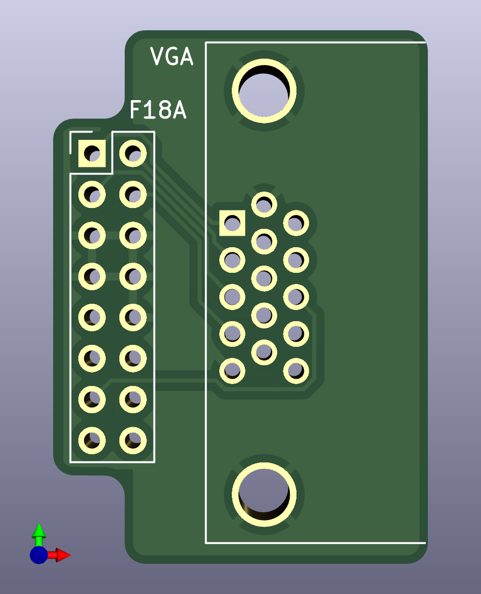
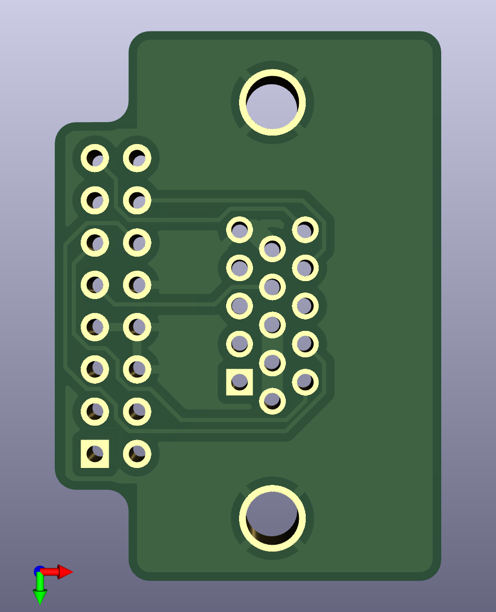

# F18A VGA Breakout Board

This is a small PCB to hold a PCB mounted DB15HD (VGA) and an IDC
connector.  It is used to connect an F18A VDP card to a VGA connector
without having to solder a cable to a VGA connector, which is fiddly
and time consuming.

The board has been produced and tested as working.  [Gerber Files](https://github.com/hanshuebner/f18-vga-breakout/releases/download/1.0/vga-breakout-gerber.zip)
